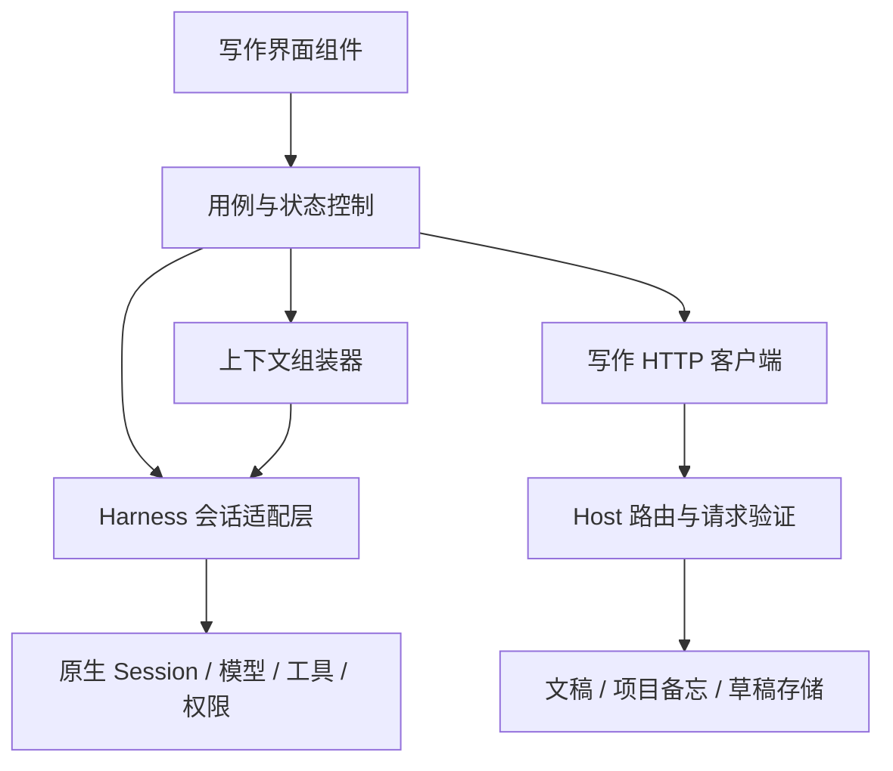

# 写作模式架构完善执行方案 v1

> 日期：2026-09-12
> 对象：接手实现的 agent；完成后交回当前审查 agent 复核。
> 性质：下一轮执行与验收方案，尚未实施。v0.1.38 已发布功能与下面的目标能力必须分开记录。
> 基线：发布 tag `v0.1.38` → `ebe452c7bf075797c8cea3fcf715bcb004c01fc5`；方案编写前 main 为 `d78d9892755f03e394c11d51079ef652a01f2b8e`。
> 实际开工时记录当前 HEAD，不假设上述提交仍是最新。技术细节可根据代码证据调整，但必须说明原因和兼容影响。

## 1. 任务结果与范围

完成一轮可独立审查的架构改造：

1. 前端从单文件拆为边界明确的源码模块，保持现有写作交互和保存行为。
2. Harness 会话接入集中到适配层，UI 不直接依赖原生消息结构或 DOM。
3. 补齐草稿、引用、异步操作在切换项目、刷新页面及多窗口时的恢复与隔离。
4. 建立第一版可查看、修订、撤回的项目备忘，支持已确认设定、作者偏好和未决问题。
5. 让对话按需参考备忘，保持自然交流，不增加固定阶段、固定轮数和每次发言的审批。
6. 补全回归、构建接线、打包版验证和交付证据，提供可见的隔离测试实例。

本轮不扩展：独立模型网关、第二套聊天记录数据库、后台陪聊/主动通知、向量数据库、全量知识库重建、多人协作、富文本编辑器替换、内核升级和大范围 UI 换肤。Markdown 富文本消息、完整原生附件 UI、复杂审批内嵌可后续做；本轮须保持明确可用的完整会话入口。

交付止于**可审查实现与预览**。用户要求由另一个 agent 做完后交回审查，因此本轮不创建 release tag、不上传安装包到 Release、不替换用户的正式安装版。常规代码、测试、隔离构建可自主完成，不因每个阶段再请求授权。

## 2. 开工阅读和运行约束

工作区：`E:\Deepseek harness`；真正仓库：`E:\Deepseek harness\dsh-desktop`。

按顺序阅读：

1. 工作区和仓库各自的 AGENTS.md、WORKLOG.md，以及新出现的子目录 AGENTS.md。
2. `docs/writing-mode-plan.md`、`plugin/writing-mode/CONTRACT.md`。
3. `logs/2026-09-12.md`〔136–140〕，区分旧中心栏停靠方案与当前独立 UI。
4. `docs/audits/release-v0.1.38/验收记录.md`，特别是旧主题冒烟断言的已知问题。
5. 实际 `client.js`、host 模块、四个写作回归脚本；Harness 接口以锁定 runtime 中代码为依据。

操作约束：

- 根目录不是 npm 项目；依赖操作只能在明确的子项目执行。
- 不修改 `runtime/`、链接指向的内核或第三方调研快照，不把补丁写进上游包。
- 不关闭、重启或终止正在使用的 Desktop/electron。测试只退出自己创建的隐藏实例；可见预览保持运行，由用户关闭。
- 新测试同时隔离 `DSH_HOME`、`DSH_DESKTOP_HOME`、`DSH_DESKTOP_USER_DATA`。打包版在 Windows 还要用独立 `LOCALAPPDATA` 隔离解压出的运行时。
- 构建输出放 `%TEMP%`；不要在工作区内生成新的 app.asar 大树。使用仓库构建逻辑及参数化输出，避免临时复制代码后忘记同步。
- 使用新的测试作品目录，不在真实作品上运行改稿/删除/迁移测试。不能复制正式环境密钥到测试目录或日志。
- 用独立开发分支保留阶段提交。先检查未提交改动，不覆盖其他 agent 的工作。推送/PR 按接手时用户授权执行；保留可审查的提交链。

## 3. 当前代码事实与主要缺口

| 位置 | 已有能力 | 本轮处理 |
|---|---|---|
| `plugin/writing-mode/client.js` | 约 3155 行；ModuleLoader 入口、样式、编辑控制、聊天、设置集中 | 分离维护源码，保留可加载产物 |
| `createEditorSession` | 唯一生产编辑控制器，含 revision、排队保存、外部刷新 | 原样提取后逐步改善，不重写第二份 |
| `lib/editor-session.js` | 为旧测试执行 client.js 的 VM 适配器 | 改为兼容转导出或迁移测试，最终取消读取整个 UI bundle 的依赖 |
| `ensureCompanionSession` 等 | 原生 workspace/session/preset 接线 | 集中到适配层，补并发与取消边界 |
| `companionRows` | 直接读原生 chat 节点，转换为右栏内容 | 作为适配器投影，UI 只读稳定模型 |
| `companionDrafts` | 页面内 Map；未发送引用不能跨刷新恢复 | durable checkpoint + 原生草稿优先，避免双写权威 |
| `index.js` / `store.js` / `domain.js` | 初步分层，domain 仍读取配置/文件 | 新模块边界清晰；只调整本轮必须的依赖，不顺手大改所有旧业务 |
| 自然交流预设 | 不硬设流程；项目文件和会话保持连续性 | 保留用户自定义；新增记忆能力不能覆盖已有预设 |
| 项目备忘 | 尚未独立实现 | 新增可确认、可追溯、可撤回的轻量系统 |

四套既有回归：`verify:writing`、`verify:writing-ui`、`verify:writing-chat`、`verify:writing-native`。既有通过记录不能代替改造后的实际运行。

## 4. 目标结构与依赖方向



建议源码结构，允许基于实际构建工具调整命名：

```text
plugin/writing-mode/
  client.js                      # 生成的 ModuleLoader 单文件产物
  src/client/
    entry.js                     # apply / inject / 槽位与销毁
    app/WritingModeApp.jsx        # 布局及跨区域编排
    features/editor/             # 编辑区、工具栏、文档切换
    features/companion/          # 对话记录、输入、引用、请求提示
    features/library/            # 树、搜索、项目创建
    features/tools/              # 文字工具、检查、台账
    features/memory/             # 项目备忘查看、编辑、确认、撤回
    features/settings/
    adapters/harness/            # 唯一原生会话接触面
    services/                    # HTTP 客户端及用例服务
    state/                       # 必要的 UI store；无聊天历史副本
    styles/                      # 源码样式，构建内联或明确复制
  src/shared/
    editor-session.js            # 无 DOM / React / Node fs 的编辑控制器
    contracts.js                 # JSDoc 类型或等价显式类型
    context-builder.js           # 纯函数：选取/排序/预算/快照
  lib/
    store.js / domain.js          # 现有 host 模块
    project-memory.js            # 新备忘读写与状态转换
    draft-checkpoints.js         # 恢复用草稿快照
    ...                          # 路径/原子存储按必要程度复用
  index.js                       # host 接线和路由
  CONTRACT.md
scripts/
  build-writing-client.mjs
  verify-writing-build.mjs
  verify-writing-memory.mjs
  verify-writing-adapter.*
```

必须满足的边界：

- 组件不能直接访问 `ctx.sessions`、原生 `chat.nodes`、工作区 API 或磁盘。
- 适配器不能依赖 JSX、UI DOM 选择器、稿纸布局和备忘业务规则。
- host 路由负责校验和调用，不把整套备忘状态机写在 handler 里。
- 编辑器 buffer/base revision/dirty 只有一个权威；对话记录只有 Harness 一个权威。
- 原生 snapshot 投影是可丢弃的只读视图，不另存聊天历史；`getSnapshot()` 在没有变化时保持引用稳定。
- 文案、样式和常量提取服务于功能边界，不以文件数或行数作为完成标准。

## 5. 阶段 A：基线、构建和编辑模块拆分

### A1. 先记录行为

在改动前运行既有回归，记录命令、退出码、HEAD 和结果。补上本轮必需但缺少的失败场景；复现出的旧 bug 单独列出，不能把错误行为固化为期望。

### A2. 建立前端构建

推荐“模块化源码 → 一个 ModuleLoader client.js”，不依赖浏览器任意路径 import，也不增加一套 React。

- 先用最小示例证明 `window.__ModuleLoader__.load({id,factory})` 兼容。
- `react` 和 `react/jsx-runtime` 继续由 Harness 的 require 提供；不得打入第二份 React/ReactDOM。
- 选择可用构建工具；若新增工具，只加固定开发依赖并更新锁文件，注明用途。不要依赖偶然存在的传递依赖。
- 默认将 `client.js` 作为已提交产物，生成头明确“不要手改”；源文件是唯一维护入口。
- 构建不包含绝对本机路径、时间戳或密钥；重复构建应可比较、无无关漂移。
- `verify-writing-build` 应输出到临时目录并比较已提交 client.js；过期产物必须失败，不能悄悄改文件后宣称一致。
- 接入 dev、Windows 构建、macOS 构建入口。确认构建发生在打包之前，不能只接一个 npm 命令而漏掉脚本直调路径。
- 当前 extraResources 的 `lib/*` 与 main 的递归同步规则必须逐项核查；新嵌套 host 文件、CSS、shared 文件若运行时需要，必须实际进入包和 profile。优先将前端样式打入 client.js。
- `src/shared` 若被 host 运行时导入，必须明确复制路径；若只是前端与测试共用，不应造成 host 在已安装环境寻找缺失源码。

### A3. 按区域提取

先编辑控制器，再库/设置/文字工具，最后工作台与写作伙伴。每次提取保留现有行为；不要一边拆文件一边换编辑器、改主题和迁移模型。

验收：源码控制器和打包 UI 使用同一实现；旧 VM 测试适配器不再是运行控制器的必要条件；四套回归通过；断网启动不需要下载前端模块。

## 6. 阶段 B：Harness 适配层

适配层显式接收 sessions/workspaces/connection。以下是本地应用契约建议，不是声称内核已有同名 API：

```text
capabilities() -> history / stream / queue / cancel / nativeDraft / pending / fullSession
resolveProject(path) -> canonical project identity
connect(project, cancellation) -> handle
handle.getSnapshot() / subscribe(listener)
handle.getDraft() / setDraft(text)
handle.send(preparedTurn) -> accepted | rejected | uncertain
handle.cancel()
handle.openFullSession()
handle.dispose()
```

稳定视图至少包含：sessionId、连接状态、消息顺序、消息文本/引用、工具活动、队列、待处理请求、错误及是否运行中。需要类型定义，不能用一个无边界 `any` 对象原样转发。

必做行为：

1. 项目标识统一由 host realpath 归一化；Windows 忽略大小写；未保存新稿使用明确的所属项目，不猜另一个项目。
2. 一个项目的同时 connect/send/设置操作共享创建中的 Promise，避免重复会话。取消订阅不等于取消或删除原生会话。
3. 跨窗口同时首次创建也要处理：原生创建若无幂等保证，采用 host 协调的绑定预留/确认机制；失效可恢复，不能留下永久锁。不凭空传内核不支持的字段。
4. A→B→A 时使用 generation 或 operation token；迟到结果可以更新其原项目持久状态，不得切走用户当前会话或发送到 B。
5. 新会话才选择 writing-companion；旧会话保留角色和模型。安装预设不覆盖本地自定义。
6. snapshot 纯投影，隐藏节点不显示，turn-tail 不复制正文；流式替换保持稳定 key，未知节点提供可见摘要和详情/完整会话入口。
7. 授权与提问不能因 UI 不支持而消失；至少明确显示请求类型和处理入口。不自动批准、不将排队误标完成。
8. 网络断开、会话被删除、恢复失败、无 API Key、接口缺失都可诊断；不得无提示地转向另一个空会话。
9. 请求超时但可能已受理时标为 uncertain，优先与原生历史/状态核对；不要静默自动重发，制造重复回合。
10. dispose 释放订阅和观察器。重进/热重载不能叠加监听；退出写作不会停止作者没有要求停止的原生任务。

权限边界不变：文档 API 的库根校验只约束该 API，不能宣称它限制了所有 Harness 原生文件工具。

验收：UI 层搜索不到原生节点 schema 和会话创建细节；真实锁定内核创建/复用/草稿共享通过；fixture 与真实集成结果分别报告。

## 7. 阶段 C：草稿与引用恢复

恢复功能是 checkpoint，不是第二个对话输入权威。

- 已连接时以原生草稿 store 为权威；未建立会话时以当前项目的本地 buffer 为权威。
- 持久草稿建议放 `$DSH_HOME/writing-mode/drafts/`，以规范化项目身份和 windowId 分桶；不要把未发送想法混进已确认项目备忘。
- 保存 text、reference 快照、schemaVersion、checkpoint revision、更新时间、所属项目/会话。不要保存 API Key、完整工具日志或整段历史。
- 连接时如本地恢复稿与非空原生稿不一致，提供比较/恢复操作，不默认覆盖其中一份。
- 引用明确是选区/稿件的某次快照，保留相对路径、基线 revision、选区范围和文本。刷新后不得悄悄改为当前磁盘内容；源文件变化应提示可以重新引用。
- 成功发送只清掉被确认发送的 checkpoint revision，不能擦除等待期间继续输入的新内容。
- 多窗口 checkpoint 不实行无条件 last-write-wins；不同窗口恢复稿可并存。恢复旧稿是用户的明确动作。
- 切换工具、专注、文件、项目以及刷新页面后行为一致。缓存写入失败须提示并保留内存稿，不拖垮编辑器。
- 限制快照大小并提供可操作提示；不要靠静默截断“保护性能”。

验收：原生输入与右栏来回不丢字；刷新可恢复引用；发送成功/失败/未知状态都不会误删草稿；两个窗口不会覆盖对方未发送内容。

## 8. 阶段 D：第一版项目备忘

### D1. 产品范围

项目备忘用于保留作者愿意延续的信息：已确认的故事设定、这个项目的表达偏好、仍待讨论的问题。第一版只做项目内，不把某作品偏好自动推广到所有作品。

入口应轻量：右栏“项目备忘”抽屉或可折叠面板。作者能直接添加/编辑；也可选中一段对话或 AI 回复“存为候选”。本轮无需做每轮自动提炼或新的后台模型任务。

建议状态与类别：

| 字段 | 取值 | 语义 |
|---|---|---|
| kind | fact / preference / open-question | 确认事实、项目偏好、待解决问题 |
| status | proposed / confirmed / resolved / retracted | 候选、作者确认、问题已解决、撤回 |
| source.kind | author / assistant / document | 信息来源；不等于可信等级 |

- AI 建议和文件摘录默认 proposed；作者直接创建并明确保存为设定/偏好时可 confirmed。
- confirmed 表示作者选择将该条纳入项目，不宣称外部事实已经客观查证。
- open-question 即使由作者确认保留，仍必须作为问题呈现，不能成为故事事实。
- 允许编辑、撤回、解决问题和恢复历史版本；不能用删除确认记录来掩盖修改。
- “恢复旧版本”应产生新 revision，而非倒退版本号。旧会话中出现过的内容无法因此从 Harness 历史抹除，UI 不承诺彻底遗忘。
- 若备忘与已有 bible 文件相冲突，标出待协调；不要静默改写 bible 或根据“更新时间更晚”宣布事实成立。

### D2. 存储与一致性

建议路径：`<projectRoot>/state/writing-memory.json`。文件名可调整，但须在 CONTRACT 中唯一确定，并确保旧项目无需迁移即可继续编辑和聊天。

```json
{
  "schemaVersion": 1,
  "revision": 1,
  "projectKey": "由 host 生成的规范化身份",
  "items": [{
    "id": "稳定唯一 ID",
    "kind": "fact",
    "status": "proposed",
    "text": "她收到信后没有拆开。",
    "source": {"kind": "assistant", "sessionId": "可选", "messageId": "可选"},
    "createdAt": "ISO 时间",
    "updatedAt": "ISO 时间",
    "confirmedAt": null
  }],
  "changes": []
}
```

这是数据形态示意，不允许把示例 projectKey 当真实身份。source 可包含项目内相对路径和文件 revision；没有稳定 messageId 时记录可核对的来源快照，不编造定位链接。

实现要求：

- 明确 schema、字段长度、状态转换、错误码；未知 schema 安全拒写，不能当空文件重建。
- 文件不存在返回空备忘；文件损坏保留原件，允许诊断/导出/从备份恢复，不影响普通聊天。
- JSON 内的 revision 是递增业务版本；API 另返回当前文件字节的 etag（如 SHA256），修改同时携带 baseRevision/baseEtag。外部编辑器可能不递增 JSON 中的版本号，因此不能只比较这个整数。旧版本或字节不匹配返回 409，同时保留用户编辑。
- 原子写入与审计变化同一事务提交。第一版可把 items 和 changes 放同一 JSON，避免“数据已写但审计没写”。设上限与安全归档策略，不能无限膨胀。
- 若多个桌面实例能同时写，采用跨进程可验证的互斥机制，在锁内读 revision、校验、写临时文件并替换。仅 JS Promise 队列无法保护另一个进程。
- 崩溃后的锁需可恢复；不要只根据超时删除仍在使用的锁。无法证明持有者已退出时返回诊断，不冒险覆写。
- 库根、项目根、symlink/junction 逃逸必须复核；备忘目录自身被替换成链接也不能越界写。
- projectKey 和来源身份不能由浏览器任意指定以读取另一项目；host 根据授权路径解析。
- 不在新功能里承诺对非合作原生工具/外部编辑器的完整事务隔离。保留文件 revision 检测和备份恢复边界。
- 旧项目、项目移动/重命名要有明确行为：不凭同名自动把不同路径的会话、草稿或备忘混在一起；需要重关联时显式提示。

建议 API：GET 备忘，POST 带 revision 的变更操作；UI 不提交“任意文件路径 + 任意 JSON”绕过状态规则。操作名称和返回字段由实现者定稿到 CONTRACT。

## 9. 阶段 E：上下文组装与自然交流

增加独立 `context-builder`，输入为作者本次消息、显式引用、当前项目身份和选中的备忘快照；输出为不可变 preparedTurn。发送途中修改备忘不回写已经准备好的消息。

第一版建议策略：

1. 作者当前消息、手动引用优先保留，不静默截断。
2. 默认可参考当前项目已确认且有效的事实/偏好；未决问题单独标识。proposed、retracted、resolved 默认不注入。
3. 输入区显示简短“参考项目备忘 · N 条”，可展开查看，也可对本次发送关闭。普通聊天不弹出逐条批准窗口。
4. 自动备忘采用明确的输入预算。可先用 6000 Unicode 字符作为保守默认上限，注明这不是精确 token 数；顺序固定、结果可测试。超限说明省略数量，提供手动选择，不限制用户发言或 AI 回复长度。
5. 优先作者选中/固定的信息，再选择相关 confirmed 条目；初版允许可解释的关键词匹配，不必引入 embedding 服务。记录选择原因便于调试，但不把内部算法塞进主界面。
6. 为防原生上下文压缩丢失而错误去重，初版可每次附带短小的当前备忘快照及 revision；去重只针对同一次 preparedTurn。若利用原生 compaction 事件优化，必须先证明该 API 可用和恢复路径可靠。
7. 备忘和引用属于上下文数据，不能冒充系统指令或工具授权；来源标记随内容保留。撤回后的新快照明确取代旧条目，不能靠缓存继续引用旧设定。
8. 备忘存储暂不可用时，作者仍能选择不带备忘继续聊天；不要静默使用别的项目或过期资料作为替代。
9. 保持 Harness 原生任务能力：作者明确要求改稿时可使用工具；讨论本身不自动创建文件或运行检查。不能把“写作伙伴”实现成每轮按固定 JSON 工具流程走的机器人。
10. 不增加每轮必填表、每轮评分、强制建议卡、三轮放行和输出长度配额。UI 对未决问题的记录不等于要求当场解决。

验收关键不是“文本已拼进 prompt”，而是来源和 revision 可核对、项目不串、作者可控制、失败可恢复，而且基础对话仍然顺畅。

## 10. 分阶段完成条件

| 阶段 | 完成后交付 | 放行条件 |
|---|---|---|
| 0 基线 | baseline.md、原行为结果与问题清单 | 能说明当前通过/失败及其原因 |
| A 模块/构建 | 新源码结构、确定性构建、编辑控制器单源 | 旧行为回归和产物一致性通过 |
| B 会话适配 | 稳定类型、适配器、能力降级与竞态处理 | fixture + 锁定真实内核通过 |
| C 恢复 | 草稿/引用 checkpoint 与恢复 UI | 刷新、多窗口、发送期间编辑通过 |
| D 备忘 | 存储/API/UI/版本与来源 | 并发、损坏、撤回、跨项目测试通过 |
| E 上下文 | preparedTurn、可见开关和预算 | 注入规则、来源、失效、普通聊天通过 |
| F 集成 | 打包验证、可见预览、审查材料 | 必做验收有证据，未验收部分明确标记 |

阶段放行是技术自检，不是要求用户逐阶段批准。遇到常规实现选择可自主决策；若必须改变产品范围或不可逆处理用户数据，再提出具体问题。不得用“需要确认”代替已经可以完成的工作。

## 11. 必做验收矩阵

下列编号用于交付报告引用。测试须检查可观察行为或数据不变量，不靠截图快照/重复业务实现凑数量。

| ID | 场景 | 必须得到的结果 |
|---|---|---|
| A01 | 清洁构建与再次构建 | 产物可复现，React 不重复，提交产物不过期 |
| A02 | 打包后离线加载 | 不依赖源码目录或联网模块；新增资源完整 |
| A03 | 模式开关、重进、卸载/重载 | 无 Hooks 错误、重复监听和失效入口 |
| E01 | 保存过程中继续输入、快速 A→B→C | 新字不丢、迟到读取不覆盖 C |
| E02 | 外部修改、历史稿、另存版本 | 冲突保留双方，历史不覆写，新版独占创建 |
| H01 | 连点发送/设置，两个窗口首次关联 | 不重复受理，不随机改变最终项目会话 |
| H02 | A 建会话中切到 B；A 返回迟到 | B 不被切走、不收到 A 消息 |
| H03 | 已有角色/模型/自定义预设 | 全部保留；重进复用原会话 |
| H04 | 历史、分块流式、结束 footer | 顺序正确、不重复正文、不抖动 key |
| H05 | 未知节点、授权、问题、附件/指令 | 请求可见且可处理；不静默丢弃/批准 |
| H06 | 拒绝/网络超时/受理结果不确定 | 草稿保留，不自动重发；状态可解释 |
| H07 | 会话删除、接口缺失、断线后恢复 | 显式恢复路径，不偷换会话 |
| D01 | 无会话草稿→创建会话→切换完整会话 | 一份权威草稿，不覆盖非空已有输入 |
| D02 | 刷新页面恢复文本与引用 | 恢复原快照；源稿变化可见 |
| D03 | 发送期间继续编辑/移除引用 | 只清理已提交版本，新输入保留 |
| D04 | 两个窗口各自编辑/恢复 | 不静默互相覆盖，恢复候选可区分 |
| D05 | 中文 IME / Enter / Shift+Enter / 停止 | 不误发送，键盘行为和取消正确 |
| M01 | AI 候选、作者确认、编辑、撤回 | 来源和状态真实；转换有审计 |
| M02 | 问题已解决、偏好撤回、恢复旧记录 | 新 revision，失效条目不再注入 |
| M03 | 项目 A/B，同名目录、大小写及移动 | 不串备忘；身份变化明确处理 |
| M04 | 旧 revision 双写、跨进程同时写 | 一方成功另一方冲突，无半文件/审计丢失 |
| M05 | 坏 JSON、未知 schema、磁盘失败、残留锁 | 原件保留，错误可恢复，普通聊天可继续 |
| M06 | 备忘目录 junction / 路径越界 / 非同源写 | 拒绝访问，正文与备忘均不越权 |
| C01 | 备忘超预算、来源被修改、已撤回 | 可解释省略，不静默截断作者消息 |
| C02 | 发送中备忘 revision 改变 | 本次快照稳定，下次读取新状态 |
| C03 | 关闭自动参考、切换项目、压缩后续聊 | 开关有效、项目隔离、无错误跨轮去重 |
| C04 | 引用含“忽略规则”等指令文本 | 保持引用数据身份，不形成工具授权 |
| P01 | 空白 home / 已有 v0.1.38 home | 无破坏性迁移，用户设置与预设保留 |
| P02 | 窄窗口、长消息、长引用、大量历史 | 输入可见、可滚动、不遮挡编辑器操作 |
| P03 | 打包版启动及资源比对 | 真实包通过，不以 dev 通过替代 |

对 H01/H06：若内核不支持严格跨进程幂等，不虚构保证；提供实测可实现的协调和 uncertain 恢复，列出剩余边界，交审查决定是否达标。

旧 `--ui-smoke` 的前置插件缺失与过时主题断言需在本轮测试维护中修正，或提供已提交、可一键运行的等价验证入口。不得继续只在日志里写“这两项可以忽略”。更新断言依据当前主题实际契约，并证明开启和复原两种行为，不能删掉失败检查换取全绿。

## 12. 真实模型体验（与工程测试分开）

有可用且获授权的测试模型配置时，至少完成以下三个场景，每个保留必要的脱敏输入/输出与判定；不伪造截图或模型答复。

1. **随意交流**：从“我有点不确定这个人物为什么这样做”开始，允许试探与改口；观察是否擅自变成固定任务表或急于改稿。
2. **设定修正**：先候选、后确认、再撤回改成另一设定；下一次回复应使用当前有效设定，不能把候选当事实。
3. **讨论转执行**：先讨论一段稿，再明确要求修改；核对上下文引用、权限请求、实际文件变更及旧版本保留情况。

测试工具只操作临时作品。记录模型/预设/时间与实际回合，不声称少量通过证明永久记忆。压缩后的连续性只有实际触发并验证才能标记通过。

若没有测试凭据：完成所有可做的工程实现和隔离预览，把本节标为“待真实模型验收”，列出具体操作步骤。不要要求把密钥粘贴进日志、对话或交付文档，也不要因此把整个任务停在半成品。

## 13. 构建、预览与回退

- 所有新增构建/检查命令写入 package.json，并列出执行目录与依赖准备步骤；对未实现命令注明新建，不声称仓库已经存在。
- 最终从阶段提交构建，证明预览中的 client.js、host 文件和所审查提交一致。生成文件变化应在提交中可追溯。
- Windows 至少完成 unpacked 打包与隔离启动，核对 app.asar 和 writing-mode 资源；若改构建入口/资源过滤，还须验证安装包构建路径。macOS 构建接线做静态与可用环境验证，不能为了验证触发会自动发布的现有 workflow。
- 可见预览放 `%TEMP%/dsh-preview/`，记录版本/commit、启动命令、userData、DSH_HOME、窗口标题、进程 ID；屏幕截图是辅助，不能代替可见实例。
- 至少准备空项目和含设定/正文/旧版本的示例项目；使用明确标注的测试内容。
- 回退以阶段提交和旧包为基础。备忘 schema 首版保持可加字段；未来 schema 被旧版打开时只读/提示，不能重置为空。
- 用户预设不自动改写；配置迁移前备份并记录，失败恢复原字节。不得回滚用户真实稿件来恢复软件版本。

## 14. 交回审查的材料

统一目录建议：`docs/audits/writing-architecture/<实际日期>/`。

必须交付：

- `handoff.md`：基线、分支、最终 commit、完成范围、未完成项、影响与回退方法。
- `architecture.md`：实际模块图、依赖方向、谁拥有哪份状态，以及对本方案的偏离和理由。
- `acceptance.md`：上表每个 ID 的通过/失败/未验证，证据路径和运行命令。不能用“整体通过”掩盖单项失败。
- 机器可读测试结果、关键失败恢复记录；fixture/真实内核/真实模型/打包测试分栏。
- `preview.md`：当前可见实例的信息、从空环境复现方式、截图和操作顺序。
- `known-issues.md`：问题触发条件、影响范围、临时处理及是否阻断交付。
- 更新后的 CONTRACT、策划案、CHANGELOG Unreleased、当日日志与 WORKLOG 索引。
- 代码 diff 和阶段提交；所有新脚本可从仓库运行，不能只有本机 Temp 中的一份脚本。

若需求确实做不到，给复现与具体缺失能力；不把建议悄悄移到“以后再说”而宣布本轮完成。

## 15. 审查 agent 的判定方式

审查时按“读 diff → 跑测试 → 操作隔离实例 → 检查文件字节和原生状态 → 真实模型场景”顺序复核。

优先检查：

1. 文件拆分是否同时减少依赖耦合，还是一个巨大 hook 换了位置。
2. 唯一编辑控制器、唯一原生聊天历史和草稿权威是否成立。
3. 模块化源码是否真被产物使用，生成 bundle 是否可复现。
4. 会话竞态、跨项目/跨窗口隔离是否有真实可触发测试。
5. 候选与作者确认是否严格区分；撤回是否影响下一次实际注入。
6. UI 是否仍自然轻量；无强制阶段、每轮记忆审批或隐藏的额外模型调用。
7. 未知消息、请求和失败是否保留可用入口。
8. 备忘故障能否与普通聊天、正文保存解耦。
9. 打包复制、旧用户升级、可见预览是否真实验证。
10. 报告所说的“通过”是否与执行输出、提交 SHA、实际文件一致。

结果分为：

- **通过，可进入发布准备**：必做工程项通过，产品行为符合要求；真实模型未验收项有清楚边界且经作者接受。
- **有条件通过**：核心闭环成立，存在不影响数据安全的明确缺口；列清后续事项，不自动发版。
- **退回修改**：丢稿/串项目、重复发送风险未处理、AI 候选被升为事实、权限请求被隐藏、包不含新代码、回归造假或主要必做项缺失。

审查通过不等于用户已批准发布。审查 agent 应先给事实、复现和修改要求，避免以“代码看起来不错”代替验收。

## 16. 给执行 agent 的启动指令（可直接复制）

> 请接手 `E:\Deepseek harness\dsh-desktop` 的写作模式架构完善。完整阅读 `docs/plans/writing-mode-architecture-v1.md` 并按阶段 0/A/B/C/D/E/F 执行：模块化前端与确定性构建、Harness 适配层、草稿/引用恢复、可确认撤回的项目备忘、透明的上下文组装、回归与隔离打包预览。保留 v0.1.38 已有功能、原生模型/工具/权限及自由交流方式，不引入固定写作轮次或每轮审批。先查 AGENTS、当前 HEAD 和未提交改动；独立分支做阶段提交，不覆盖别人的工作，不修改内核、不关闭用户窗口、不触碰真实稿件或密钥。常规实现选择自主推进，偏离方案需给证据；缺模型凭据时继续完成工程工作并明确标记真实体验待验收。完成后按文档第 14 节交付材料，并拉起保持运行的可见隔离测试实例。不要发布或替换正式版，我会把结果交回原审查 agent 复核。

— 编写：Codex / GPT-6。本文执行步骤为下一轮目标，不能引用为功能已经完成的证据。
